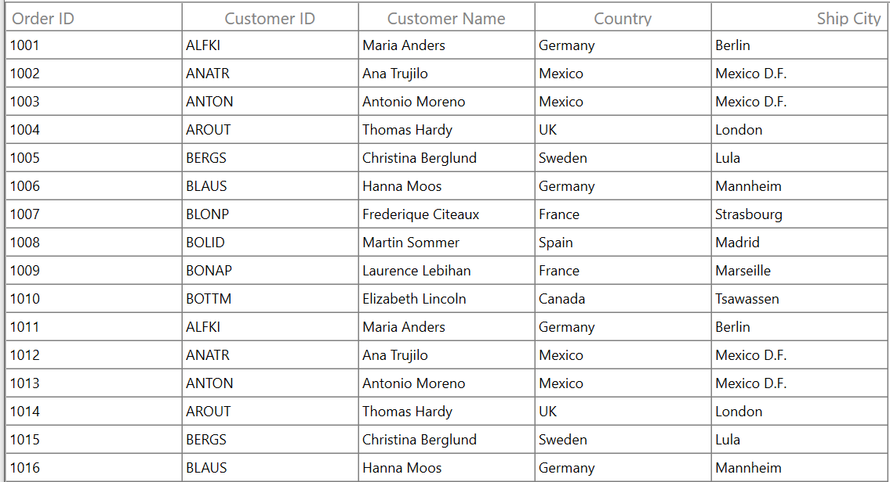
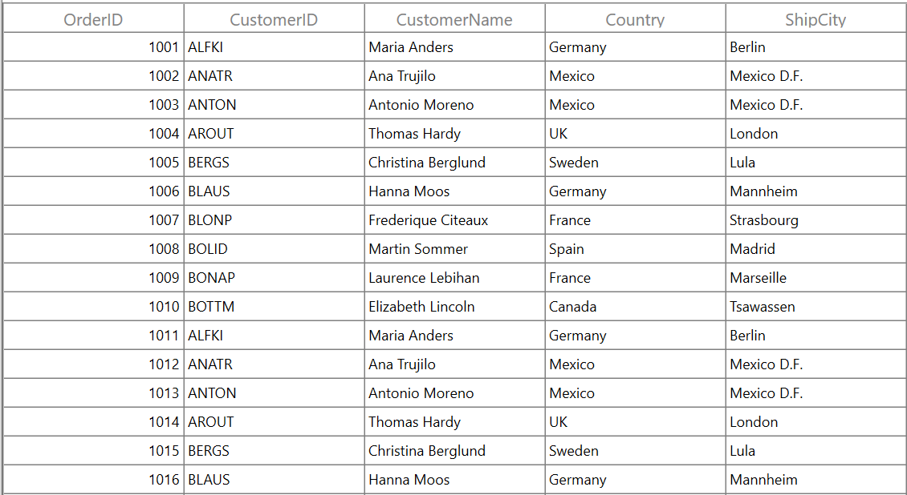
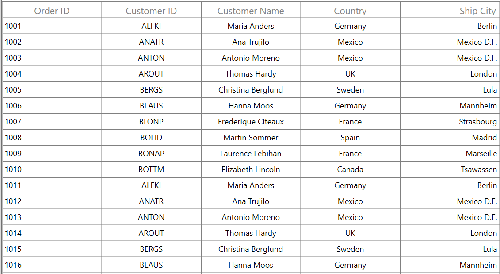
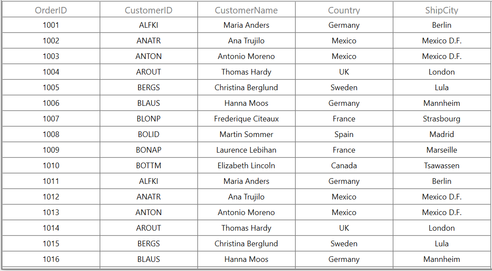
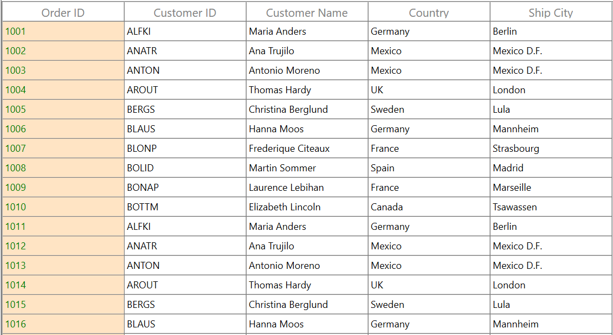
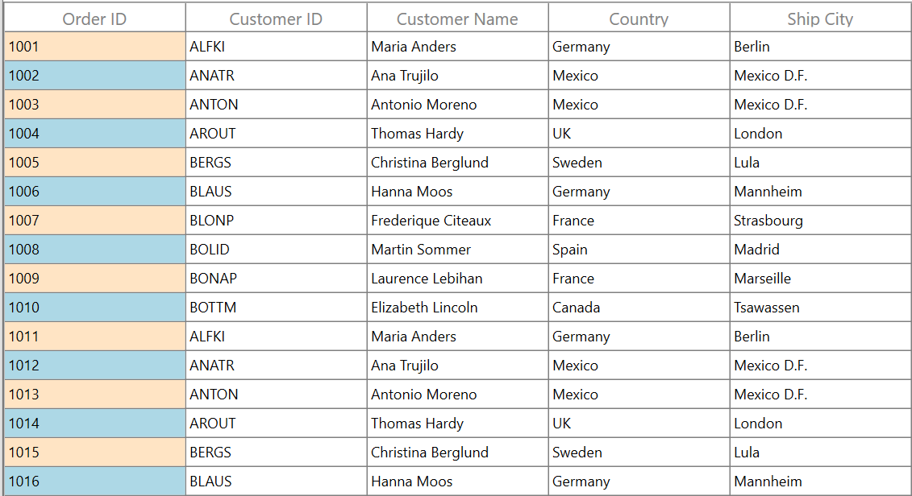
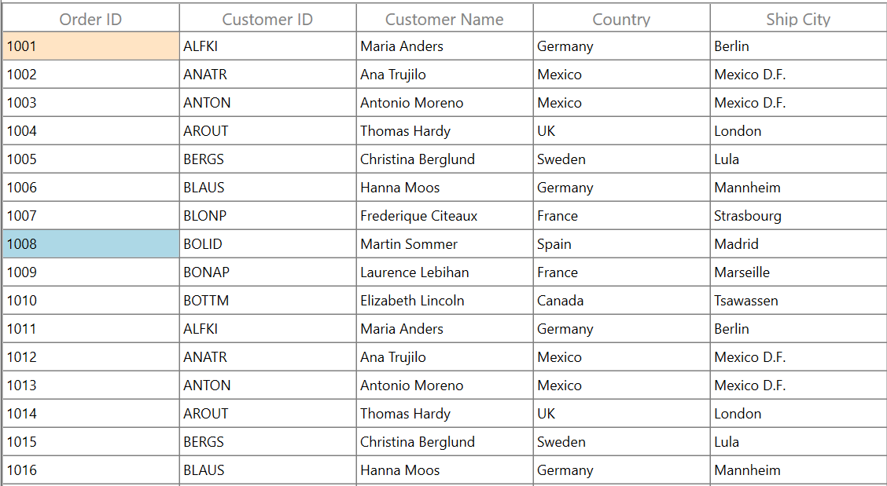

# How to Change the Column Alignment in WPF DataGrid?

This example illustrates how to align a column content in [WPF DataGrid](https://www.syncfusion.com/wpf-controls/datagrid) (SfDataGrid).

DataGrid provides the support to change the content alignment, background color, foreground color, border and font for [GridColumn](https://help.syncfusion.com/cr/wpf/Syncfusion.UI.Xaml.Grid.GridColumn.html).

### Column header alignment

You can change the column header's horizontal alignment using [HorizontalHeaderContentAlignment](https://help.syncfusion.com/cr/wpf/Syncfusion.UI.Xaml.Grid.GridColumnBase.html#Syncfusion_UI_Xaml_Grid_GridColumnBase_HorizontalHeaderContentAlignment) property.

``` xml
<syncfusion:SfDataGrid  x:Name="dataGrid" 
                        AutoGenerateColumns="False"
                        ItemsSource="{Binding Orders}">
    <syncfusion:SfDataGrid.Columns>
        <syncfusion:GridTextColumn MappingName="OrderID" 
                                   HeaderText="Order ID"
                                   HorizontalHeaderContentAlignment="Left"/>
        <syncfusion:GridTextColumn MappingName="CustomerID" 
                                   HeaderText="Customer ID"
                                   HorizontalHeaderContentAlignment="Center"/>
        <syncfusion:GridTextColumn MappingName="CustomerName" 
                                   HeaderText="Customer Name"
                                   HorizontalHeaderContentAlignment="Center"/>
        <syncfusion:GridTextColumn MappingName="Country" 
                                   HeaderText="Country"
                                   HorizontalHeaderContentAlignment="Center"/>
        <syncfusion:GridTextColumn MappingName="ShipCity" 
                                   HeaderText="Ship City"
                                   HorizontalHeaderContentAlignment="Right"/>
    </syncfusion:SfDataGrid.Columns>
 
</syncfusion:SfDataGrid>
```



You can also change the column header’s horizontal alignment when columns are auto generated. It can be done by using the [AutoGeneratingColumn](https://help.syncfusion.com/cr/wpf/Syncfusion.UI.Xaml.Grid.SfDataGrid.html#Syncfusion_UI_Xaml_Grid_SfDataGrid_AutoGeneratingColumn) event.   

``` csharp
this.dataGrid.AutoGeneratingColumn += DataGrid_AutoGeneratingColumn;

private void DataGrid_AutoGeneratingColumn(object sender, Syncfusion.UI.Xaml.Grid.AutoGeneratingColumnArgs e)
{
    e.Column.HorizontalHeaderContentAlignment = HorizontalAlignment.Center;
}
```



### Column alignment

You can change the content alignment in both horizontal and vertical direction of [GridColumn](https://help.syncfusion.com/cr/wpf/Syncfusion.UI.Xaml.Grid.GridColumn.html) using [TextAlignment](https://help.syncfusion.com/cr/wpf/Syncfusion.UI.Xaml.Grid.GridColumnBase.html#Syncfusion_UI_Xaml_Grid_GridColumnBase_TextAlignment) and [VerticalAlignment](https://help.syncfusion.com/cr/wpf/Syncfusion.UI.Xaml.Grid.GridColumnBase.html#Syncfusion_UI_Xaml_Grid_GridColumnBase_VerticalAlignment) properties.

``` xml
<syncfusion:SfDataGrid  x:Name="dataGrid" 
                        AutoGenerateColumns="False"
                        ItemsSource="{Binding Orders}">
    <syncfusion:SfDataGrid.Columns>
        <syncfusion:GridTextColumn MappingName="OrderID" 
                                   HeaderText="Order ID"
                                   TextAlignment="Left"  
                                   VerticalAlignment="Center"/>
        <syncfusion:GridTextColumn MappingName="CustomerID" 
                                   HeaderText="Customer ID"
                                   TextAlignment="Center"  
                                   VerticalAlignment="Center"/>
        <syncfusion:GridTextColumn MappingName="CustomerName" 
                                   HeaderText="Customer Name"
                                   TextAlignment="Center"  
                                   VerticalAlignment="Center"/>
        <syncfusion:GridTextColumn MappingName="Country" 
                                   HeaderText="Country"
                                   TextAlignment="Center"  
                                   VerticalAlignment="Center"/>
        <syncfusion:GridTextColumn MappingName="ShipCity" 
                                   HeaderText="Ship City"
                                   TextAlignment="Right"  
                                   VerticalAlignment="Center"/>
    </syncfusion:SfDataGrid.Columns>
 
</syncfusion:SfDataGrid>
```



You can also change the content alignment of columns when they are auto generated. It can be done by using the [AutoGeneratingColumn](https://help.syncfusion.com/cr/wpf/Syncfusion.UI.Xaml.Grid.SfDataGrid.html#Syncfusion_UI_Xaml_Grid_SfDataGrid_AutoGeneratingColumn) event.


``` xml
this.dataGrid.AutoGeneratingColumn += DataGrid_AutoGeneratingColumn;

private void DataGrid_AutoGeneratingColumn(object sender, Syncfusion.UI.Xaml.Grid.AutoGeneratingColumnArgs e)
{
       e.Column.TextAlignment = TextAlignment.Center;
       e.Column.VerticalAlignment = VerticalAlignment.Center;
}
```



### Column styling

You can customize the appearance of [GridColumn](https://help.syncfusion.com/cr/wpf/Syncfusion.UI.Xaml.Grid.GridColumn.html) by using the [GridColumn.CellStyle](https://help.syncfusion.com/cr/wpf/Syncfusion.UI.Xaml.Grid.GridColumnBase.html#Syncfusion_UI_Xaml_Grid_GridColumnBase_CellStyle) property. You can customize the background, foreground, border and font. DataGrid also support to customize entire column and it can be done by using [SfDataGrid.CellStyle](https://help.syncfusion.com/cr/wpf/Syncfusion.UI.Xaml.Grid.SfDataGrid.html#Syncfusion_UI_Xaml_Grid_SfDataGrid_CellStyle) property.

``` xml
<syncfusion:SfDataGrid  x:Name="dataGrid" 
                        AutoGenerateColumns="False"
                        ItemsSource="{Binding Orders}">
    <syncfusion:SfDataGrid.Columns>
        <syncfusion:GridTextColumn MappingName="OrderID" 
                                   HeaderText="Order ID">
            <syncfusion:GridTextColumn.CellStyle>
                <Style TargetType="syncfusion:GridCell">
                    <Setter Property="Background" Value="Bisque" />
                    <Setter Property="Foreground" Value="Green"/>
                </Style>
            </syncfusion:GridTextColumn.CellStyle>
        </syncfusion:GridTextColumn>
                                  
        <syncfusion:GridTextColumn MappingName="CustomerID" 
                                   HeaderText="Customer ID"/>
        <syncfusion:GridTextColumn MappingName="CustomerName" 
                                   HeaderText="Customer Name"/>
        <syncfusion:GridTextColumn MappingName="Country" 
                                   HeaderText="Country"/>
        <syncfusion:GridTextColumn MappingName="ShipCity" 
                                   HeaderText="Ship City"/>
    </syncfusion:SfDataGrid.Columns>
</syncfusion:SfDataGrid>
```



Take a moment to peruse the [style customization](https://help.syncfusion.com/wpf/datagrid/styles-and-templates#styling-record-cell) documentation.

### Conditional styling

You can customize the appearance of the `GridColumn` conditionally based on data in three ways,

* Using Converter
* Using Style selector
* Using Data triggers

#### Using converter

[GridColumn](https://help.syncfusion.com/cr/wpf/Syncfusion.UI.Xaml.Grid.GridColumn.html) can be customized conditionally by changing its property value based on cell value or data object using converter.

``` xml
<Window.DataContext>
    <local:ViewModel/>
</Window.DataContext>
<Window.Resources>
   <local:ColorConverter x:Key="converter"/>
</Window.Resources>
<Grid>
    <syncfusion:SfDataGrid  x:Name="dataGrid" 
                            AutoGenerateColumns="False"
                            ItemsSource="{Binding Orders}">
        <syncfusion:SfDataGrid.Columns>
            <syncfusion:GridTextColumn MappingName="OrderID" 
                                       HeaderText="Order ID">
                <syncfusion:GridTextColumn.CellStyle>
                    <Style TargetType="syncfusion:GridCell">
                        <Setter Property="Background" Value="{Binding Path=OrderID,Converter={StaticResource converter}}"/>
                    </Style>
                </syncfusion:GridTextColumn.CellStyle>
            </syncfusion:GridTextColumn>
                                      
            <syncfusion:GridTextColumn MappingName="CustomerID" 
                                       HeaderText="Customer ID"/>
            <syncfusion:GridTextColumn MappingName="CustomerName" 
                                       HeaderText="Customer Name"/>
            <syncfusion:GridTextColumn MappingName="Country" 
                                       HeaderText="Country"/>
            <syncfusion:GridTextColumn MappingName="ShipCity" 
                                       HeaderText="Ship City"/>
        </syncfusion:SfDataGrid.Columns>
    </syncfusion:SfDataGrid>
</Grid>
```

``` csharp
public class ColorConverter : IValueConverter
{
    public object Convert(object value, Type targetType, object parameter, CultureInfo culture)
    {
        int input = (int)value;
        //custom condition is checked based on data.
    
        if (input % 2 == 0)
            return new SolidColorBrush(Colors.LightBlue);
        else 
            return new SolidColorBrush(Colors.Bisque);
    }
 
    public object ConvertBack(object value, Type targetType, object parameter, CultureInfo culture)
    {
        throw new NotImplementedException();
    }
}
```


#### Using style selector

[GridColumn](https://help.syncfusion.com/cr/wpf/Syncfusion.UI.Xaml.Grid.GridColumn.html) can be customized conditionally based on data by setting [SfDataGrid.CellStyleSelector](https://help.syncfusion.com/cr/wpf/Syncfusion.UI.Xaml.Grid.SfDataGrid.html#Syncfusion_UI_Xaml_Grid_SfDataGrid_CellStyleSelectorProperty) property and the particular column can be customized by setting [GridColumn.CellStyleSelector](https://help.syncfusion.com/cr/wpf/Syncfusion.UI.Xaml.Grid.GridColumnBase.html#Syncfusion_UI_Xaml_Grid_GridColumnBase_CellStyleSelectorproperty) property.

``` xml
<Application.Resources>
    <local:SelectorClass x:Key="styleSelector"/>
    <Style x:Key="blueCellStyle" TargetType="syncfusion:GridCell">
        <Setter Property="Background" Value="LightBlue" />
    </Style>
    <Style x:Key="bisqueCellStyle" TargetType="syncfusion:GridCell">
        <Setter Property="Background" Value="Bisque" />
    </Style>
</Application.Resources>
 
<syncfusion:SfDataGrid  x:Name="dataGrid"                          
                         AutoGenerateColumns="True"
                         CellStyleSelector="{StaticResource styleSelector}"
                         ItemsSource="{Binding Orders}">
 </syncfusion:SfDataGrid>
```

``` csharp
public class SelectorClass : StyleSelector
{
    public override Style SelectStyle(object item, DependencyObject container)
    {
        var data = item as OrderInfo;
 
        if (data != null && ((container as GridCell).ColumnBase.GridColumn.MappingName == "OrderID"))
        {
            //custom condition is checked based on data.
            if (data.OrderID % 2 == 0)
                return App.Current.Resources["blueCellStyle"] as Style;
            return App.Current.Resources["bisqueCellStyle"] as Style;
        }
        return base.SelectStyle(item, container);
    }
}
```



#### Using triggers

[GridColumn](https://help.syncfusion.com/cr/wpf/Syncfusion.UI.Xaml.Grid.GridColumn.html) can be customized by setting `Style.Triggers` that apply property values based on specified conditions. Multiple conditions can be specified by setting `MultiDataTrigger`.

``` xml
<syncfusion:GridTextColumn MappingName="OrderID" 
                           HeaderText="Order ID">
    <syncfusion:GridTextColumn.CellStyle>
        <Style TargetType="syncfusion:GridCell">
            <Style.Triggers>
                <!--Background property set based on cell content-->
                <DataTrigger Binding="{Binding Path=OrderID}" Value="1001">
                    <Setter Property="Background" Value="Bisque" />
                </DataTrigger>
                <!--Background property set based on multiple conditions-->
                <MultiDataTrigger>
                    <MultiDataTrigger.Conditions>
                        <Condition Binding="{Binding Path=OrderID}" Value="1008" />
                        <Condition Binding="{Binding Path=CustomerID}" Value="BOLID" />
                    </MultiDataTrigger.Conditions>
                    <Setter Property="Background" Value="LightBlue" />
                </MultiDataTrigger>
            </Style.Triggers>
        </Style>
    </syncfusion:GridTextColumn.CellStyle>
</syncfusion:GridTextColumn>
```



You can refer to the [user guide](https://help.syncfusion.com/wpf/datagrid/column-types) to learn more about the DataGrid’s columns feature sets.
